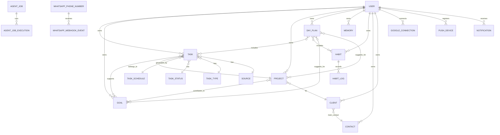
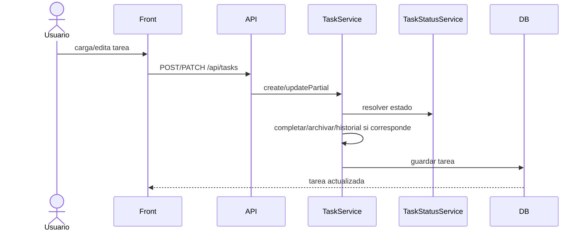
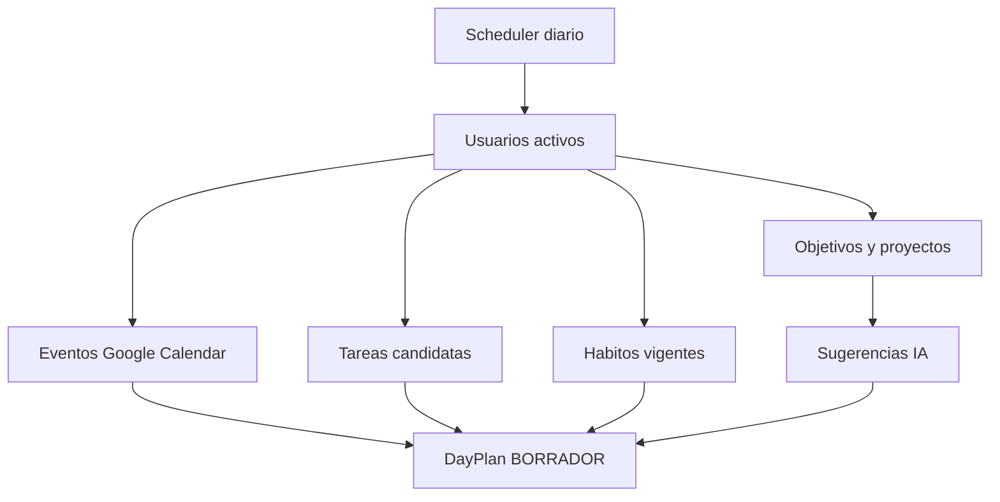
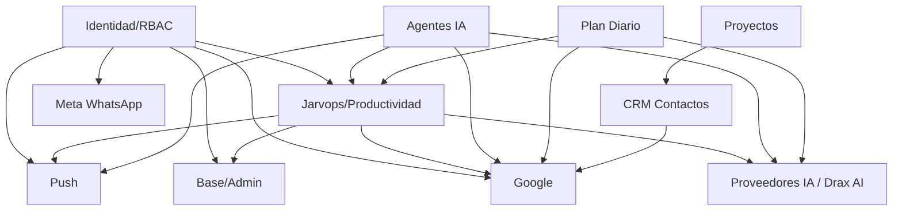

# 1. Descripcion general

Jarvops, antes LifeOps, es un sistema personal de productividad y organizacion de vida. Combina gestion de tareas, objetivos, proyectos, habitos, contactos, memorias y planificacion diaria con agentes de IA, integraciones con Google y canales de notificacion.

El sistema esta orientado principalmente a un unico usuario funcional: el propietario del proyecto. Aun asi, la arquitectura incluye identidad, roles, permisos, tenants, sesiones y API keys provistos por Drax Identity, por lo que tecnicamente soporta multiples usuarios y perfiles administrativos.

El problema central que resuelve es organizar la vida de forma mas eficiente: capturar tareas, priorizarlas, relacionarlas con objetivos/proyectos, automatizar tareas recurrentes, generar planes diarios, mantener contexto persistente y usar asistentes IA para operar sobre esa informacion.

Principales capacidades:

- Gestion de tareas, estados, prioridades, fuentes, tipos y programaciones recurrentes.
- Gestion de objetivos, proyectos, areas de vida, propositos, habitos y registros de habitos.
- CRM personal para organizaciones/personas, clientes/proveedores y contactos.
- Memorias persistentes para guardar contexto reutilizable por usuarios y agentes.
- Agentes IA conversacionales y jobs de agente programados.
- Planificacion diaria con eventos de Google Calendar, tareas candidatas, habitos y sugerencias IA.
- Integracion con Google OAuth, Gmail, Calendar y Contacts.
- Push notifications via Firebase Cloud Messaging.
- Registro de webhooks de WhatsApp Business / Meta.
- Administracion base: usuarios, roles, permisos, auditoria, settings, media, recuperacion y notificaciones.

# 2. Alcance funcional

- Administracion de identidad, roles, permisos, tenants, sesiones y API keys.
- Administracion de configuracion, auditoria, media y recuperacion provista por modulos Drax.
- Gestion de notificaciones internas y estado de lectura.
- Captura y administracion de tareas.
- Visualizacion de tareas en CRUD, kanban, dashboard y flujo de chatbot.
- Automatizacion de tareas recurrentes mediante reglas de calendario.
- Archivado automatico de tareas completadas o marcadas para archivo.
- Clasificacion/asistencia de tareas con IA.
- Gestion de metas personales, proyectos y areas de vida.
- Gestion experimental de propositos y habitos.
- Generacion de planes diarios.
- Gestion de clientes, proveedores y contactos.
- Sincronizacion de contactos con Google Contacts.
- Consulta de Gmail y Google Calendar desde el frontend y desde tools de agentes.
- Creacion de eventos de calendario via API.
- Registro y envio de push notifications.
- Recepcion publica de mensajes push mediante enlace.
- Registro de numeros de WhatsApp y almacenamiento de eventos de webhook.
- Ejecucion programada de agentes IA.

# 3. Arquitectura general

El proyecto es un monorepo con tres paquetes principales:

- `front/`: frontend Vue 3 + Vuetify + Pinia + vue-router + vue-i18n.
- `back/`: API Fastify con TypeScript, Zod, Drax Framework, MongoDB o SQLite segun configuracion.
- `arch/`: paquete de generacion basado en `@drax/arch` para producir CRUDs backend/frontend desde schemas.

La arquitectura es un monolito modular con frontend + API. El backend registra modulos Drax de identidad, auditoria, media, settings, dashboard, AI, recovery y CRUD saved queries, ademas de modulos locales (`base`, `lifeops`, `google`, `push`, `meta`).

Persistencia:

- MongoDB es el motor configurado por defecto en `.env.example`.
- SQLite esta soportado por factories y repositorios alternativos.
- Mongoose se usa para MongoDB.

Procesos independientes:

- `back/src/index.ts` inicia la API Fastify.
- `back/src/index-job.ts` inicia los schedulers automaticos: agent jobs, day plans, task archive y task schedule.

Integraciones externas:

- Proveedores IA por `@drax/ai-back` (`AI_PROVIDER`, OpenAI, Google AI, DeepSeek).
- Google OAuth, Gmail, Calendar y People/Contacts APIs.
- Firebase Cloud Messaging para push.
- Meta WhatsApp webhook.
- ElevenLabs TTS via configuracion Drax AI/TTS.
- Email por Gmail o SMTP en configuracion Drax.

# 4. Modulos funcionales

## 4.1 Productividad Personal / Jarvops

### Objetivo

Es el dominio principal del sistema. Organiza tareas, metas, proyectos, areas de vida, habitos, memorias y planes diarios para convertir informacion personal en acciones priorizadas y automatizadas.

### Funcionalidades

- Gestionar tareas: permite crear, editar, consultar, importar/exportar, eliminar y visualizar tareas. Puede ejecutarlo un usuario autenticado con permisos `task:*`.
- Clasificar tareas: el servicio de triage usa IA para sugerir fuente, tipo, area de vida, estado, prioridad, objetivos, proyecto, scores y urgencia.
- Cambiar estados de tareas: si un estado tiene `completesTask`, marca `completedAt`; si tiene `archivesTask`, marca `archivedAt`; ademas registra historial de cambios de estado.
- Gestionar tareas programadas: define reglas `once`, `interval`, `daily`, `weekly`, `monthly` y `yearly` que crean tareas automaticamente.
- Generar planes diarios: arma un `DayPlan` con eventos de Google Calendar, tareas candidatas, habitos vigentes y sugerencias IA.
- Gestionar objetivos y proyectos: organiza metas y proyectos con prioridad, scores, fechas, progreso, cliente asociado y archivado.
- Gestionar memorias: guarda informacion persistente con tipo, area, tags, prioridad, fuente y usuario.
- Gestionar propositos y habitos: modela propositos personales y habitos activos con frecuencia y posible generacion de tarea.
- Gestionar catalogos: fuentes, tipos de tarea, estados, prioridades, areas de vida, tipos de contacto y tipos de memoria.
- Usar vistas frontend: CRUDs, kanban de tareas, dashboard de tareas, chatbot para tareas y paginas de agente.

### Entidades principales

**Task**

Proposito:
Representa una accion o pendiente personal.

Informacion principal:

- titulo y descripcion;
- fuente, tipo, area de vida, estado y prioridad;
- objetivos y proyecto asociados;
- scores de valor, motivacion y esfuerzo;
- urgencia;
- fechas de vencimiento y programacion;
- ids externos de Redmine, email o calendario;
- tags, notas e historial de estados;
- usuario;
- fechas de completado y archivado.

Relaciones:

- pertenece a un usuario;
- puede pertenecer a un proyecto;
- puede relacionarse con varios objetivos;
- puede originarse en un `TaskSchedule`;
- puede estar asociada a un evento de calendario, email o issue externa.

Estados:

- El estado funcional se define por `TaskStatus`.
- Un `TaskStatus` puede completar o archivar automaticamente una tarea.
- El historial guarda transiciones `previousStatus -> newStatus`.

**TaskSchedule**

Proposito:
Representa una regla para crear tareas automaticamente.

Informacion principal:

- nombre y activo/inactivo;
- plantilla de tarea;
- tipo de schedule;
- timezone, hora, dias, meses, intervalos o fecha puntual;
- regla de vencimiento;
- runtime con ultima corrida, proxima corrida, ultimo resultado y error;
- ventana `startAt` / `endAt`.

Relaciones:

- pertenece a un usuario;
- genera tareas;
- puede asociar la tarea generada con objetivos/proyecto.

Estados:

- Activo o inactivo.
- Runtime: ultimo estado `success` o `failed`.

**DayPlan**

Proposito:
Representa el plan de un dia para un usuario.

Informacion principal:

- fecha;
- usuario;
- estado;
- eventos de calendario;
- tareas seleccionadas;
- habitos seleccionados;
- sugerencias IA.

Relaciones:

- pertenece a un usuario;
- referencia tareas, habitos, objetivos y proyectos;
- incorpora eventos de Google Calendar por id externo.

Estados:

- `BORRADOR`;
- `VISTO`;
- `CONFIRMADO`;
- `CERRADO`.

Las decisiones internas de eventos/tareas/habitos/sugerencias son:

- `PENDIENTE`;
- `COMPROMETIDO`;
- `DESEABLE`;
- `DESCARTADO`.

**Goal**

Proposito:
Representa un objetivo personal.

Informacion principal:

- nombre y descripcion;
- prioridad;
- scores de valor, motivacion y esfuerzo;
- area de vida;
- horizonte temporal;
- fecha objetivo;
- progreso;
- completado o archivado.

Relaciones:

- pertenece a un usuario;
- puede ser referenciado por tareas, proyectos, planes diarios y sugerencias IA.

**Project**

Proposito:
Representa un conjunto de trabajo asociado a objetivos y, opcionalmente, a un cliente/organizacion.

Informacion principal:

- nombre y descripcion;
- prioridad;
- objetivos;
- cliente;
- scores y prioridad calculada/manual;
- fechas de inicio, objetivo y completado;
- progreso;
- aliases, tags y archivado.

Relaciones:

- pertenece a un usuario;
- puede vincularse con un cliente;
- puede agrupar objetivos y tareas.

**Memory**

Proposito:
Guarda informacion persistente para consulta humana o uso por agentes IA.

Informacion principal:

- titulo;
- contenido;
- tipo;
- area de vida;
- tags;
- prioridad;
- fuente;
- usuario.

Relaciones:

- pertenece a un usuario;
- usa catalogos de tipo de memoria, area, prioridad o fuente por nombre/id segun contexto.

**Purpose**

Proposito:
Representa un enunciado de proposito personal.

Informacion principal:

- titulo;
- declaracion;
- indicador principal;
- activo;
- usuario.

Observacion:
El contexto del responsable indica que es una entidad experimental; el codigo confirma CRUD, permisos y tool de agente.

**Habit**

Proposito:
Representa una practica recurrente.

Informacion principal:

- nombre y descripcion;
- area de vida;
- activo;
- frecuencia diaria/semanal/mensual;
- flag para generar tarea;
- plantilla de tarea;
- usuario.

Relaciones:

- puede aparecer en `DayPlan`;
- puede tener registros en `HabitLog`.

**HabitLog**

Proposito:
Registra una ocurrencia de habito.

Informacion principal:

- habito;
- fecha;
- tarea opcional relacionada.

### Procesos principales

1. El usuario crea o edita una tarea.
2. El servicio valida la entrada con Zod.
3. Si cambia el estado, el sistema registra historial.
4. Si el estado completa o archiva, setea fechas automaticas.
5. La tarea queda disponible en CRUD, kanban, dashboard, agentes y jobs.

1. El usuario define una tarea programada.
2. El servicio calcula `runtime.nextRunAt`.
3. El scheduler busca schedules vencidos.
4. Para cada ocurrencia crea una tarea con la plantilla.
5. Evita duplicados buscando por `taskSchedule + scheduledFor`.
6. Actualiza runtime y proxima ejecucion.

1. El scheduler de plan diario corre a la hora configurada.
2. Busca usuarios activos.
3. Para cada usuario obtiene eventos de Google Calendar, tareas candidatas, habitos, objetivos y proyectos.
4. Pide sugerencias a IA si hay objetivos/proyectos.
5. Crea o actualiza el `DayPlan` del dia.

### Reglas de negocio relevantes

- `TaskSchedule` valida que `endAt` sea posterior a `startAt`.
- `TaskSchedule` exige `runAt`, intervalo, dias de semana, dias de mes o meses segun el tipo de schedule.
- `TaskSchedule` exige `daysAfter` cuando la regla de vencimiento es `daysAfter`.
- `TaskSchedule` inicializa `nextRunAt` automaticamente al crear o activar.
- Las tareas generadas por schedule no permiten modificar manualmente `taskSchedule` ni `scheduledFor` en updates normales.
- El archivado automatico mueve tareas completadas/archivables luego de una ventana configurable, por defecto 72 horas.
- El triage IA no debe inventar opciones fuera de los catalogos disponibles.
- El plan diario limita tareas candidatas y sugerencias para mantener foco.

### Integraciones

- IA para triage de tareas y sugerencias de plan diario.
- Google Calendar para incorporar eventos diarios.
- Google Calendar/Gmail/Contacts y Push como tools disponibles para agentes, segun configuracion.

### Observaciones

- El sistema aun no cubre control economico, consistente con el contexto informado.
- `Purpose` y `Habit` existen implementados pero fueron indicados como experimentales.
- Hay referencias a Redmine (`redmineIssueId`, `redmineProjectIds`) pero no se encontro integracion local completa en el codigo relevado.

## 4.2 Agentes IA y Automatizacion Inteligente

### Objetivo

Permitir que asistentes IA consulten y modifiquen informacion de Jarvops mediante tools controladas, tanto en conversaciones como en jobs programados.

### Funcionalidades

- Agente general: opera sobre tareas, tareas programadas, memorias, clientes, proyectos y contactos.
- Agente CRM: opera sobre partes/organizaciones y contactos.
- Agente Mindset: opera sobre propositos, habitos y objetivos.
- Job agent: ejecuta instrucciones programadas con tools permitidas y logging de tool calls.
- Registro de ejecuciones: guarda estado, prompt snapshot, resultado, tool calls, errores y uso de tokens.

### Entidades principales

**AgentJob**

Proposito:
Representa un job de agente configurado para ejecutarse manualmente o por schedule.

Informacion principal:

- nombre y descripcion;
- activo;
- system prompt;
- tools permitidas;
- schedule `once`, `daily`, `weekly`, `monthly`, `interval` o `cron`;
- timezone;
- timeout y reintentos;
- runtime con ultimo/proximo run y ultimo estado;
- creador.

Relaciones:

- tiene muchas ejecuciones `AgentJobExecution`.

Estados:

- Activo/inactivo.
- Ultimo estado de runtime: `success`, `failed`, `timeout`.

**AgentJobExecution**

Proposito:
Registra una corrida concreta de un job de agente.

Informacion principal:

- job;
- estado;
- trigger;
- horario programado;
- inicio/fin/duracion;
- intento;
- prompt snapshot;
- resultado;
- tool calls;
- error;
- uso de tokens.

Estados:

- `pending`;
- `running`;
- `success`;
- `failed`;
- `timeout`.

Triggers:

- `scheduled`;
- `manual`;
- `retry`.

### Procesos principales

1. El scheduler busca `AgentJob` activos vencidos.
2. Crea una ejecucion `running` para la ocurrencia.
3. Configura `JobAgent` con prompt y tools permitidas.
4. Ejecuta el agente con timeout y registra tool calls.
5. Guarda resultado, error y usage.
6. Actualiza runtime del job y calcula proxima ejecucion.
7. Reintenta si corresponde.

### Reglas de negocio relevantes

- Una ocurrencia programada no debe ejecutarse dos veces; se busca ejecucion existente por job y `scheduledFor`.
- Si el job esta inactivo, no se ejecuta.
- Los jobs pueden limitar tools por nombre.
- Las tools de entidad aplican filtro/asignacion/assert de usuario cuando corresponde.

### Integraciones

- Proveedor IA configurado por `AI_PROVIDER`.
- Tools de Google y Push cuando se preparan en agentes general/job.

### Observaciones

- El sistema usa `@drax/ai-back` para proveedores, agentes, logs, TTS y sesiones.
- El frontend expone paginas `/agent` y `/agentc`.

## 4.3 CRM Personal y Contactos

### Objetivo

Gestionar personas, organizaciones, clientes y proveedores que se relacionan con proyectos, tareas y contactos externos.

### Funcionalidades

- Gestionar socios comerciales con roles `client`, `provider` o ambos; sin clasificar: `roles: []`.
- Registrar informacion fiscal, sitio web, aliases, tags, notas y contacto principal.
- Gestionar contactos con emails, telefonos, direcciones, organizacion, cumpleaños, foto, tags y estado.
- Sincronizar contactos individuales con Google.
- Sincronizar masivamente Google Contacts hacia contactos locales.

### Entidades principales

**BusinessPartner**

Proposito:
Representa una organizacion, parte comercial o persona de interes para proyectos/trabajo.

Informacion principal:

- nombre y razon social;
- condicion/datos fiscales;
- descripcion;
- roles;
- prioridad;
- sitio web;
- aliases;
- contacto principal;
- ids de proyectos Redmine;
- tags y notas;
- usuario;
- archivado.

Relaciones:

- pertenece a un usuario;
- puede tener un contacto principal;
- puede estar vinculado a proyectos.

**Contact**

Proposito:
Representa una persona o contacto sincronizable.

Informacion principal:

- fuente `manual`, `google`, `imported` o `api`;
- proveedor/id externo;
- nombre visible, nombre, apellido y nickname;
- emails y telefonos;
- organizacion;
- direcciones;
- foto;
- cumpleaños;
- notas y tags;
- estado;
- fecha de ultima sincronizacion;
- usuario.

Relaciones:

- pertenece a un usuario;
- puede estar asociado como contacto principal de un cliente;
- puede tener correspondencia con Google People API.

Estados:

- `active`;
- `archived`;
- `deleted`.

### Procesos principales

1. El usuario conecta una cuenta Google con permisos de Contacts.
2. Ejecuta sincronizacion.
3. El sistema obtiene contactos desde People API.
4. Mapea contactos Google a formato local.
5. Busca coincidencias por ids externos, email/telefono u otros indices.
6. Crea, actualiza o saltea contactos segun `updateExisting`.

### Reglas de negocio relevantes

- Para crear o actualizar contactos en Google se requiere scope de escritura.
- Para leer contactos alcanza scope readonly o completo.
- La sincronizacion evita duplicados mediante indices construidos desde contactos existentes.
- Antes de crear partes/contactos por agente CRM, el prompt instruye buscar duplicados.

### Integraciones

- Google People API / Contacts.

### Observaciones

- La entidad "BusinessPartner" representa una relacion comercial como cliente, proveedor o ambos.

## 4.4 Integracion Google

### Objetivo

Conectar cuentas Google para autenticacion, acceso a Gmail, Calendar y Contacts, y proveer datos/herramientas a usuarios y agentes.

### Funcionalidades

- Login con Google.
- Crear URL OAuth para conectar permisos especificos.
- Completar callback OAuth y guardar tokens.
- Listar conexiones del usuario.
- Consultar permisos disponibles.
- CRUD administrativo de `GoogleConnection`.
- Listar mensajes Gmail y ver detalle.
- Listar calendarios, listar eventos y crear eventos.
- Listar, crear y sincronizar contactos.

### Entidades principales

**GoogleConnection**

Proposito:
Representa una conexion OAuth entre un usuario de Jarvops y una cuenta Google.

Informacion principal:

- usuario;
- proveedor `google`;
- email y user id de Google;
- access token y refresh token;
- scopes;
- expiry date;
- estado;
- ultima utilizacion;
- fecha de conexion.

Relaciones:

- pertenece a un usuario.

Estados:

- `active`;
- `revoked`;
- `error`.

### Procesos principales

1. El frontend solicita permisos de conexion.
2. El backend genera URL OAuth con scopes seleccionados.
3. Google redirige al callback frontend.
4. El frontend envia `code` y `redirectUri` al backend.
5. El backend intercambia token, verifica `id_token`, obtiene perfil y guarda/actualiza `GoogleConnection`.
6. Los servicios usan refresh token para obtener access token valido.

### Reglas de negocio relevantes

- El callback exige `id_token`, email y `sub`.
- Si Google no devuelve refresh token, se reutiliza el existente; si no existe, falla.
- Los servicios verifican que la conexion pertenezca al usuario autenticado.
- Cada servicio valida scopes: Gmail read/send/modify, Calendar read/write, Contacts read/write.

### Integraciones

- Google OAuth2.
- Gmail API.
- Calendar API.
- People API.

### Observaciones

- Los tokens estan modelados dentro de `GoogleConnection`; se debe proteger su acceso en produccion.

## 4.5 Notificaciones y Push

### Objetivo

Registrar notificaciones internas y enviar mensajes push a dispositivos web/mobile mediante Firebase.

### Funcionalidades

- CRUD de notificaciones internas.
- Marcar notificaciones como leidas.
- CRUD de dispositivos push.
- Registro publico/autenticado de dispositivos push.
- CRUD de mensajes push.
- Enviar push de prueba.
- Enviar push al navegador.
- Consultar mensaje push publico por id.
- Paginas frontend para prueba/recepcion push.

### Entidades principales

**Notification**

Proposito:
Representa una notificacion interna para un usuario.

Informacion principal:

- titulo;
- mensaje;
- tipo `info`, `success`, `warning`, `error`;
- estado;
- usuario;
- metadata;
- fecha de lectura.

Estados:

- `unread`;
- `read`.

**PushDevice**

Proposito:
Representa un dispositivo capaz de recibir notificaciones push.

Informacion principal:

- usuario opcional;
- invitado o usuario autenticado;
- plataforma `android`, `ios` o `web`;
- token;
- nombre del dispositivo;
- habilitado;
- ultimo visto.

**PushMessage**

Proposito:
Representa un mensaje push registrado y potencialmente enviado.

Informacion principal:

- usuario opcional;
- titulo y cuerpo;
- estado;
- id del proveedor;
- tipo;
- link;
- error;
- fecha de envio.

Estados:

- `pending`;
- `sent`;
- `failed`;
- `read`.

### Procesos principales

1. El navegador registra un token FCM.
2. El backend guarda o actualiza `PushDevice`.
3. El sistema crea un `PushMessage`.
4. El servicio envia a FCM.
5. Guarda estado, id de proveedor o error.

### Reglas de negocio relevantes

- Los dispositivos pueden pertenecer a usuario o ser invitados.
- El endpoint publico de mensaje push permite abrir `/push/:idpush`.

### Integraciones

- Firebase Cloud Messaging.

### Observaciones

- El frontend contiene variables `VITE_FIREBASE_*`.
- El backend requiere `FIREBASE_PROJECT_ID` y `FIREBASE_SERVICE_ACCOUNT_PATH`.

## 4.6 Meta / WhatsApp

### Objetivo

Registrar numeros de WhatsApp Business y almacenar eventos de webhook recibidos desde Meta.

### Funcionalidades

- CRUD de numeros de WhatsApp.
- CRUD de eventos de webhook.
- Verificacion de webhook de Meta.
- Recepcion y registro de payloads de webhook.

### Entidades principales

**WhatsAppPhoneNumber**

Proposito:
Representa un numero de WhatsApp Business asociado a un tenant.

Informacion principal:

- tenant;
- phone number id;
- WABA id;
- numero visible;
- habilitado.

**WhatsAppWebhookEvent**

Proposito:
Representa un evento recibido desde Meta/WhatsApp.

Informacion principal:

- tenant opcional;
- referencia de numero;
- objeto y field;
- WABA id y phone number id;
- fecha de recepcion y fecha del evento;
- estado de procesamiento;
- intentos;
- error;
- payload completo;
- clave de deduplicacion.

Estados:

- `PENDING`;
- `PROCESSING`;
- `PROCESSED`;
- `IGNORED`;
- `ERROR`.

### Procesos principales

1. Meta llama `GET /api/meta/whatsapp/webhook`.
2. El backend valida `hub.verify_token` contra `META_WHATSAPP_WEBHOOK_VERIFY_TOKEN`.
3. Meta envia eventos por `POST /api/meta/whatsapp/webhook`.
4. El backend registra el payload como `WhatsAppWebhookEvent`.

### Reglas de negocio relevantes

- La verificacion falla con 403 si el token no coincide.
- El evento guarda payload completo y estado inicial de procesamiento.

### Integraciones

- Meta WhatsApp Cloud API / Webhooks.

### Observaciones

- No se encontro un consumer de procesamiento posterior de eventos; el codigo relevado registra eventos.

## 4.7 Plataforma Base, Seguridad y Administracion

### Objetivo

Proveer autenticacion, autorizacion, configuracion, auditoria, media, salud, cuenta y funciones administrativas compartidas.

### Funcionalidades

- Login/autenticacion por JWT y API key.
- RBAC por permisos individuales.
- Usuarios, roles, tenants, sesiones, login fails y API keys.
- Auditoria de eventos CRUD.
- Settings.
- Media/files.
- Dashboard.
- Recovery.
- Healthcheck.
- Desactivacion de cuenta.
- Notificaciones internas.

### Entidades principales

**User / Role / Tenant**

Proposito:
Entidades provistas por `@drax/identity-back` para identidad, permisos y multi-tenancy.

Informacion principal:

- usuario autenticado;
- rol asignado;
- permisos;
- tenant si esta habilitado.

**Audit Event**

Proposito:
Registra eventos CRUD emitidos por `CrudEventEmitter`.

### Procesos principales

1. Al iniciar, `SetupDrax` carga configuracion desde env.
2. Inicializa Mongo si corresponde.
3. Carga permisos de modulos Drax y locales.
4. Setea politica de passwords.
5. Activa auditoria.
6. Inicializa settings.
7. Crea root/admin y roles de sistema.
8. Si la API se inicio con seed, ejecuta `InitLifeops`.
9. Inicializa agentes.

### Reglas de negocio relevantes

- Las rutas Fastify usan middlewares globales `jwtMiddleware`, `apiKeyMiddleware` y `rbacMiddleware`.
- Los CRUDs declaran permisos `create`, `view`, `update`, `delete`, `manage`.
- El rol Admin recibe todos los permisos cargados.
- El rol Operator existe pero se inicializa sin permisos en el codigo.
- Supervisor esta definido pero no se crea actualmente porque esta comentado en `CreateSystemRoles`.

### Integraciones

- Drax Identity, Audit, Media, Settings, Dashboard, AI, Recovery y CRUD.

### Observaciones

- `front/.env.example` habilita tenant y dashboard de usuario/rol.
- `InitializeSettings` todavia guarda `AppName=LIFEOPS`, aunque el nombre informado actual es Jarvops.

# 5. Roles y usuarios

## Admin

**Objetivo**

Administrador total del sistema.

**Principales permisos**

Recibe `PermissionService.getPermissions()`, es decir, todos los permisos cargados por modulos Drax y modulos locales.

**Modulos a los que accede**

Todos: identidad, Jarvops, Google, Push, Meta, notificaciones, settings, auditoria, media, AI y recovery.

## Operator

**Objetivo**

Rol por defecto operativo.

**Principales permisos**

En el codigo esta creado sin permisos explicitos.

**Modulos a los que accede**

No se puede determinar funcionalmente; depende de permisos asignados luego o de ajustes externos.

## Supervisor

**Objetivo**

Rol intermedio con administracion parcial de usuarios.

**Principales permisos**

Definido con permisos de crear/ver/gestionar/actualizar usuarios, ver roles y ver tenants. Incluye `Operator` como child role.

**Modulos a los que accede**

Identidad y administracion basica.

**Observacion**

Esta definido pero no se crea actualmente porque su inicializacion esta comentada.

## Usuario propietario

**Objetivo**

Perfil funcional principal informado: el dueno del sistema.

**Principales permisos**

Inferido: necesita permisos para tareas, proyectos, objetivos, contactos, agentes, Google y planes diarios.

**Modulos a los que accede**

Jarvops, Google, IA/agentes, notificaciones y push.

## Visitante / publico

**Objetivo**

Acceso sin autenticacion a paginas o endpoints puntuales.

**Principales permisos**

No usa permisos RBAC para rutas publicas.

**Modulos a los que accede**

Landing, login, politicas/terminos, callback Google login, pagina web push y recepcion publica de push.

# 6. Modelo de informacion

Resumen conceptual:

```text
User
  -> Task
      -> TaskStatus
      -> TaskType
      -> Source
      -> Priority
      -> LifeArea
      -> Goal
      -> Project
      -> TaskSchedule
  -> Goal
  -> Project
      -> BusinessPartner
  -> DayPlan
      -> Task
      -> Habit
      -> Goal
      -> Project
      -> Google Calendar Event
  -> Habit
      -> HabitLog
  -> Memory
  -> Purpose
  -> BusinessPartner
      -> Contact
  -> Contact
  -> GoogleConnection
  -> PushDevice
  -> PushMessage
  -> Notification
```

Diagrama conceptual:



# 7. Flujos principales del sistema

## 7.1 Captura y evolucion de una tarea

1. El usuario crea una tarea desde CRUD, chatbot, agente o API.
2. El backend valida `TaskBaseSchema`.
3. El servicio normaliza notas.
4. Si se asigna estado, busca `TaskStatus`.
5. Si el estado completa o archiva, setea `completedAt` o `archivedAt`.
6. En updates, registra historial de estado.
7. La tarea queda disponible para busquedas, dashboard, kanban, agentes, planes diarios y archivado.



## 7.2 Generacion de tarea programada

1. El usuario crea un `TaskSchedule`.
2. El servicio calcula la proxima ocurrencia.
3. El job corre cada minuto por defecto.
4. Busca schedules vencidos.
5. Por cada vencido, revisa si ya existe tarea para esa ocurrencia.
6. Crea tarea desde la plantilla.
7. Actualiza runtime con exito/error y siguiente corrida.

## 7.3 Archivado automatico de tareas

1. El job corre cada hora por defecto.
2. Calcula cutoff usando `TASK_ARCHIVE_AFTER_HOURS` o 72 horas.
3. Busca lotes de tareas pendientes de archivo.
4. Mueve/archiva cada tarea mediante repository.
5. Registra conteos de encontradas, archivadas y fallidas.

## 7.4 Plan diario

1. El job corre una vez por dia a la hora configurada, 06:00 por defecto.
2. Busca usuarios activos.
3. Trae eventos del calendario primario de Google.
4. Selecciona tareas pendientes con score.
5. Busca habitos activos que correspondan al dia.
6. Busca objetivos y proyectos activos.
7. Genera sugerencias IA en espanol.
8. Crea o actualiza el plan del dia.



## 7.5 Conexion Google

1. El usuario abre la pagina de conexiones.
2. El frontend pide una URL de autorizacion con permisos seleccionados.
3. Google autentica y devuelve `code`.
4. El frontend valida `state` local.
5. El backend intercambia el code por tokens.
6. Verifica identidad Google.
7. Crea o actualiza `GoogleConnection`.
8. Gmail, Calendar y Contacts usan esa conexion.

## 7.6 Sincronizacion de contactos Google

1. El usuario ejecuta sincronizacion.
2. El backend valida usuario y conexion con scope suficiente.
3. Descarga contactos desde People API.
4. Mapea campos Google a `Contact`.
5. Busca contactos existentes.
6. Crea, actualiza o saltea.
7. Devuelve resumen de total, creados, actualizados y omitidos.

## 7.7 Ejecucion de Agent Job

1. El scheduler corre cada minuto por defecto.
2. Busca jobs activos vencidos.
3. Crea ejecucion `running`.
4. Configura agente con prompt y tools permitidas.
5. Ejecuta con timeout.
6. Registra tool calls, resultado, error y tokens.
7. Actualiza runtime y proxima ejecucion.

## 7.8 Push notification

1. El cliente obtiene token FCM.
2. Registra `PushDevice`.
3. El sistema crea `PushMessage`.
4. El backend envia via Firebase.
5. Actualiza estado `sent` o `failed`.
6. El receptor puede abrir `/push/:idpush`.

## 7.9 Webhook WhatsApp

1. Meta verifica el webhook con `hub.verify_token`.
2. El backend compara con `META_WHATSAPP_WEBHOOK_VERIFY_TOKEN`.
3. Meta envia eventos por POST.
4. El sistema registra `WhatsAppWebhookEvent`.
5. El evento queda con estado de procesamiento para seguimiento.

# 8. Integraciones externas

| Integracion | Proposito | Tipo | Modulos que la utilizan |
|---|---|---|---|
| Google OAuth2 | Login y conexion de cuentas Google | OAuth2 / REST | Google, Base/Identidad |
| Gmail API | Listar/ver emails y tools de agente | REST | Google, Agentes |
| Google Calendar API | Calendarios, eventos, planes diarios y tools | REST | Google, DayPlan, Agentes |
| Google People API | Contactos y sincronizacion | REST | Google, CRM |
| Proveedores IA (`@drax/ai-back`) | Agentes, triage, sugerencias de plan diario, TTS/logs | SDK/REST via Drax | Jarvops, Agentes, DayPlan |
| OpenAI | Proveedor IA configurable | REST via Drax | Agentes/IA |
| Google AI | Proveedor IA configurable | REST via Drax | Agentes/IA |
| DeepSeek | Proveedor IA configurable | REST via Drax | Agentes/IA |
| Firebase Cloud Messaging | Push notifications | REST/SDK | Push |
| Meta WhatsApp Cloud API | Verificacion y recepcion de webhooks | Webhook HTTP | Meta |
| ElevenLabs | Text-to-speech | REST via Drax TTS | AI/TTS |
| Email Gmail/SMTP | Envio de emails por infraestructura Drax | SMTP/Gmail | Recovery/Email/Drax |

# 9. Procesos automaticos

| Proceso | Objetivo | Ejecucion | Informacion que procesa | Resultado |
|---|---|---|---|---|
| AgentJob scheduler | Ejecutar jobs IA vencidos | Cada `AGENT_JOB_INTERVAL_MS`, 60s por defecto | `AgentJob` activos con `nextRunAt` vencido | `AgentJobExecution`, runtime actualizado |
| DayPlan scheduler | Generar planes diarios | Una vez por dia, 06:00 por defecto | Usuarios activos, Google Calendar, tareas, habitos, objetivos, proyectos | `DayPlan` creado/actualizado |
| TaskSchedule scheduler | Crear tareas recurrentes | Cada `TASK_SCHEDULE_INTERVAL_MS`, 60s por defecto | `TaskSchedule` activos vencidos | Tareas creadas y runtime actualizado |
| TaskArchive scheduler | Archivar tareas completadas/archivables | Cada hora por defecto | Tareas con criterio de archivo y cutoff | Tareas archivadas |
| Auditoria CRUD | Registrar cambios de entidades | Evento interno `crud:event` | Operaciones CRUD | Eventos de auditoria Drax |
| Setup seed | Inicializar catalogos/base de LifeOps | Al iniciar API con `seed=true` | Datos de `InitLifeops` | Datos iniciales |

No se encontraron colas externas tipo RabbitMQ/Kafka ni workers separados con consumidores persistentes. Los procesos automaticos se implementan con `setInterval`/`setTimeout` dentro del proceso `index-job.ts`.

# 10. API

La API es REST sobre Fastify. La mayoria de recursos CRUD exponen un patron comun:

- `GET /api/<resource>`: paginar.
- `GET /api/<resource>/find`: buscar por filtros.
- `GET /api/<resource>/search`: busqueda.
- `GET /api/<resource>/:id`: obtener por id.
- `GET /api/<resource>/find-one`: obtener uno.
- `GET /api/<resource>/group-by`: agrupar.
- `POST /api/<resource>`: crear.
- `PUT /api/<resource>/:id`: reemplazar/actualizar.
- `PATCH /api/<resource>/:id`: actualizacion parcial.
- `DELETE /api/<resource>/:id`: eliminar.
- En muchos CRUDs: `GET /export` y `POST /import`.

## Base

- `GET /api/health`: healthcheck.
- `POST /api/account/deactivate`: desactiva cuenta.
- `/api/notifications`: CRUD de notificaciones.
- `PUT /api/notifications/:id/read-state`: marca notificacion como leida.

## Jarvops / LifeOps

CRUDs principales:

- `/api/tasks`
- `/api/task-schedules`
- `/api/task-statuses`
- `/api/task-types`
- `/api/sources`
- `/api/priorities`
- `/api/goals`
- `/api/projects`
- `/api/business-partners`
- `/api/contacts`
- `/api/contact-types`
- `/api/memories`
- `/api/memory-types`
- `/api/purposes`
- `/api/life-areas`
- `/api/habits`
- `/api/habit-logs`
- `/api/day-plans`
- `/api/agent-jobs`
- `/api/agent-job-executions`

Endpoints especificos detectados:

- `POST /api/tasks/:id/triage`: clasificacion IA de tarea.
- `GET /api/tasks/archived`: paginacion de tareas archivadas.
- `POST /api/task-schedules/:id/activate`: activar programacion.
- `POST /api/task-schedules/:id/deactivate`: desactivar programacion.
- `POST /api/day-plans/generate/today`: generar plan diario para el usuario.
- `POST /api/contacts/:id/sync-google`: sincronizar contacto individual con Google.

## Google

- `POST /api/google/login`: login Google.
- `POST /api/google/logout`: logout Google.
- `GET /api/google/connections/permissions`: permisos/scopes disponibles.
- `GET /api/google/connections/me`: conexiones del usuario.
- `POST /api/google/connections/auth-url`: URL OAuth para conexion.
- `POST /api/google/connections/callback`: completar OAuth.
- `/api/google-connections`: CRUD administrativo/import/export.
- `GET /api/google/gmail/messages`: listar Gmail.
- `GET /api/google/gmail/messages/:id`: ver mensaje Gmail.
- `GET /api/google/calendar/calendars`: listar calendarios.
- `GET /api/google/calendar/events`: listar eventos.
- `POST /api/google/calendar/events`: crear evento.
- `GET /api/google/contacts`: listar Google Contacts.
- `POST /api/google/contacts`: crear contacto Google.
- `POST /api/google/contacts/sync`: sincronizar contactos hacia Jarvops.

## Push

- `/api/push-devices`: CRUD/import/export.
- `POST /api/push-devices/register`: registrar dispositivo.
- `/api/push-messages`: CRUD/import/export.
- `POST /api/push-messages/test`: enviar prueba.
- `POST /api/push-messages/browser`: enviar al navegador.
- `GET /api/push-messages/public/:id`: obtener mensaje publico.

## Meta / WhatsApp

- `/api/whatsapp-phone-numbers`: CRUD/import/export.
- `/api/whatsapp-webhook-events`: CRUD/import/export.
- `GET /api/meta/whatsapp/webhook`: verificacion webhook.
- `POST /api/meta/whatsapp/webhook`: registro de evento webhook.

## Drax Framework

Ademas se registran rutas provistas por paquetes Drax para usuarios, roles, tenants, API keys, sesiones, login fails, media/files, settings, dashboard, audit, AI, TTS, agent sessions, Drax agents, saved queries y recovery.

# 11. Tecnologia

- Lenguaje principal: TypeScript.
- Frontend: Vue 3, Vuetify 3, Vite, Pinia, vue-router, vue-i18n.
- Backend: Node.js, Fastify, Zod.
- Framework base: Drax (`@drax/*`).
- Persistencia: MongoDB con Mongoose; SQLite soportado con `better-sqlite3`.
- API docs: Swagger/OpenAPI por Fastify y `CrudSchemaBuilder`.
- IA: `@drax/ai-back` con providers configurables.
- Notificaciones push: Firebase.
- Tests backend: Vitest / Node test runner segun scripts y dependencias, con MongoDB in-memory.
- Build/deploy: Dockerfile multi-stage y PM2 runtime.

# 12. Configuracion y ejecucion

## Requisitos

- Node.js moderno; Dockerfile usa Node 24.
- MongoDB local o remoto si `DRAX_DB_ENGINE=mongo`.
- Opcional: archivo SQLite si `DRAX_DB_ENGINE=sqlite`.
- Credenciales de Google OAuth para integracion Google.
- Credenciales IA segun proveedor seleccionado.
- Credenciales Firebase para push.
- Token de verificacion Meta WhatsApp si se usa webhook.

## Variables relevantes

Backend:

- `DRAX_JWT_SECRET`, `DRAX_JWT_EXPIRATION`, `DRAX_JWT_ISSUER`
- `DRAX_APIKEY_SECRET`
- `DRAX_DEFAULT_ROLE`
- `DRAX_DB_ENGINE`
- `DRAX_MONGO_URI`
- `DRAX_SQLITE_FILE`
- `DRAX_PORT`
- `DRAX_BASE_URL`
- `GOOGLE_CLIENT_ID`, `GOOGLE_CLIENT_SECRET`
- `AI_PROVIDER`
- `OPENAI_API_KEY`, `OPENAI_MODEL`, `OPENAI_VISION_MODEL`
- `GOOGLE_AI_API_KEY`, `GOOGLE_AI_MODEL`
- `DEEPSEEK_API_KEY`, `DEEPSEEK_MODEL`
- `AGENT_JOB_INTERVAL_MS`, `AGENT_JOB_RUN_LIMIT`
- `TASK_SCHEDULE_INTERVAL_MS`, `TASK_SCHEDULE_RUN_LIMIT`
- `TASK_ARCHIVE_INTERVAL_MS`, `TASK_ARCHIVE_AFTER_HOURS`, `TASK_ARCHIVE_BATCH_SIZE`
- `DAY_PLAN_JOB_HOUR`, `DAY_PLAN_JOB_MINUTE`, `DAY_PLAN_JOB_RUN_ON_START`, `DAY_PLAN_JOB_USER_LIMIT`
- `FIREBASE_PROJECT_ID`, `FIREBASE_SERVICE_ACCOUNT_PATH`
- `META_WHATSAPP_WEBHOOK_VERIFY_TOKEN`
- `ELEVENLABS_API_KEY`, `ELEVENLABS_BASE_URL`, `ELEVENLABS_MODEL`, `ELEVENLABS_VOICE_ID`, `ELEVENLABS_OUTPUT_FORMAT`
- `RECOVERY_ENABLED`, `RECOVERY_MASTER_PASSWORD`, `RECOVERY_MAX_UPLOAD_BYTES`, `RECOVERY_NAME`

Frontend:

- `VITE_TITLE_MAIN`, `VITE_TITLE_SEC`
- `VITE_HTTP_TRANSPORT`
- `VITE_DRAX_TENANT`
- `VITE_DRAX_USER_ROLE_DASHBOARD`
- `VITE_GOOGLE_CLIENT_ID`
- `VITE_NOTIFICATIONS`
- `VITE_FIREBASE_API_KEY`
- `VITE_FIREBASE_PROJECT_ID`
- `VITE_FIREBASE_MESSAGING_SENDER_ID`
- `VITE_FIREBASE_APP_ID`
- `VITE_FIREBASE_VAPID_KEY`

## Comandos principales

Backend:

- `npm run back`: API en desarrollo con nodemon y `.env`.
- `npm run jobs`: proceso de jobs en desarrollo.
- `npm run build`: compila para salida `out`.
- `npm run build:local`: compila para `build`.
- `npm run test`: ejecuta tests.
- `npm run recoveryAdmin`: recuperacion de password admin.
- `npm run initRootUserAndAdminRole`: inicializacion root/admin.

Frontend:

- `npm run front`: dev server Vite.
- `npm run build`: typecheck y build.
- `npm run build:local`: build hacia `../build/public`.
- `npm run preview`: preview Vite.
- `npm run lint`: ESLint con fix.

Arch:

- `npm run build`: generacion desde schemas.
- `npm run copy:safe`: copia generada segura.
- `npm run copy:force`: copia forzada.

## Observacion de seguridad

Se detectaron archivos `.env` con valores reales o sensibles en el repositorio local. La documentacion evita reproducirlos, pero conviene validar si esos archivos estan versionados o deben rotarse/excluirse.

# 13. Dependencias entre modulos

Dependencias principales:



Dependencias fuertes observadas:

- Todos los modulos protegidos dependen de Identity/RBAC.
- Agentes dependen de servicios LifeOps y de Drax AI.
- DayPlan depende de tareas, habitos, objetivos, proyectos, Google Calendar y proveedor IA.
- TaskSchedule depende de TaskService para crear tareas.
- TaskService depende de TaskStatusService para automatizar completado/archivado.
- Google Contacts depende de ContactService para sincronizar contactos locales.
- Push tools pueden ser usadas por agentes.

# 14. Puntos criticos

- `TaskService`: centraliza reglas de estado, notas, historial, completado y archivado.
- `TaskScheduleService` y `TaskScheduleJob`: crean tareas automaticamente; un error puede duplicar o perder tareas recurrentes.
- `DayPlanJob`: combina Google Calendar, IA y datos personales; errores afectan planificacion diaria.
- `AgentJob`: ejecuta acciones autonomas con tools; requiere control cuidadoso de permisos, allowed tools y logs.
- `GoogleConnection`: almacena tokens OAuth; es informacion sensible.
- `.env` local: contiene secretos reales; riesgo operativo si se versiona o comparte.
- RBAC global: la seguridad depende de middlewares globales y permisos correctos en rutas.
- `Admin`: tiene todos los permisos; debe protegerse especialmente.
- `Operator`: rol por defecto sin permisos en codigo; puede generar accesos vacios si no se configura.
- `WhatsAppWebhookEvent.payload`: almacena payload completo externo; puede contener datos sensibles.
- Jobs con `setInterval` en proceso unico: si se ejecutan multiples replicas, puede haber ejecuciones concurrentes salvo controles por ocurrencia.
- `InitLifeops` se ejecuta al iniciar API con seed; puede modificar datos iniciales.

# 15. Glosario

- **Jarvops**: nombre actual del sistema.
- **LifeOps**: nombre anterior y nombre de modulo/carpeta principal.
- **Task**: tarea o accion pendiente.
- **TaskSchedule**: regla que genera tareas automaticamente.
- **DayPlan**: plan diario con eventos, tareas, habitos y sugerencias.
- **Memory**: informacion persistente para contexto personal o IA.
- **Purpose**: proposito personal, marcado como experimental por contexto del responsable.
- **Habit**: habito personal, tambien indicado como experimental.
- **AgentJob**: job programado ejecutado por un agente IA.
- **Tool**: funcion invocable por un agente IA para consultar o modificar entidades.
- **Triage**: clasificacion IA de una tarea.
- **Source**: origen de una tarea o memoria.
- **LifeArea**: area de vida usada para clasificar objetivos, habitos, tareas o memorias.
- **WABA**: WhatsApp Business Account.
- **FCM**: Firebase Cloud Messaging.
- **RBAC**: control de acceso basado en roles/permisos.

# 16. Dudas y puntos a validar

- El nombre visible del sistema debe ser Jarvops, pero `InitializeSettings` todavia inicializa `AppName` como `LIFEOPS`. ¿Debe actualizarse?
- `Purpose` y `Habit` estan implementados, pero fueron informados como experimentales. ¿Deben mantenerse en navegacion y agentes o quedar ocultos?
- No se encontraron entidades economicas/financieras. ¿Cuales son las entidades esperadas para cubrir control economico?
- `Operator` es el rol por defecto en `.env.example`, pero se crea sin permisos. ¿El usuario inicial operativo se configura manualmente despues?
- `Supervisor` esta definido pero no se crea. ¿Debe habilitarse o eliminarse?
- Hay referencias a Redmine en `BusinessPartner` y `Task`, pero no se encontro integracion implementada en modulos activos. ¿Redmine sigue en roadmap?
- Los webhooks WhatsApp se registran, pero no se encontro procesamiento posterior. ¿El procesamiento esta pendiente o ocurre fuera de este repo?
- El proceso de jobs usa timers en memoria. ¿Se espera correr una sola instancia o hace falta coordinacion distribuida?
- GoogleConnection permite CRUD administrativo con `userFilter=false`. ¿Debe restringirse por usuario en vistas no admin?
- El archivo `.env` local contiene secretos reales. ¿Debe rotarse credenciales y excluirse del repositorio?
- `docker-compose.yml` parece referir un servicio/imagen `edni/dnie`, no Jarvops. ¿Es legado?
- El build generado `build/` convive con fuente. ¿Debe considerarse artefacto ignorado o parte del deploy?

# 17. Informacion inferida

## Confirmado por codigo

- El proyecto es un monorepo con `front`, `back` y `arch`.
- El backend es Fastify + Drax + Zod con MongoDB/SQLite.
- El frontend es Vue 3 + Vuetify.
- Hay modulos locales `base`, `lifeops`, `google`, `push` y `meta`.
- Hay middlewares globales JWT, API key y RBAC.
- Hay CRUDs para tareas, objetivos, proyectos, contactos, clientes, memorias, propositos, habitos, planes diarios, jobs IA, conexiones Google, push y WhatsApp.
- Existen schedulers para agent jobs, day plans, task schedules y task archive.
- Existen integraciones Google, Firebase, Meta WhatsApp, proveedores IA y TTS.
- Existen roles Admin y Operator creados por setup; Supervisor esta definido pero comentado.

## Informado como contexto

- Nombre actual: Jarvops.
- Nombre anterior: LifeOps.
- Objetivo general: sistema de productividad y organizacion de vida.
- Usuario principal: el propietario del proyecto.
- Problema: organizar la vida de forma eficiente.
- Integraciones conocidas: proveedores IA.
- Proposito y Habito son experimentales.
- Faltan entidades para control economico.

## Inferido

- Aunque el sistema tiene RBAC multiusuario, funcionalmente esta pensado para uso personal.
- `BusinessPartner` representa socios comerciales con roles de cliente, proveedor o ambos.
- Las entidades catalogo (`Source`, `Priority`, `LifeArea`, `TaskType`, etc.) actuan como vocabulario controlado para tareas, memorias y agentes.
- Los agentes estan pensados para operar datos del usuario con herramientas seguras y trazables.
- WhatsApp esta en una etapa de recepcion/registro mas que de automatizacion conversacional completa.
- La integracion Redmine parece futura o parcial.
